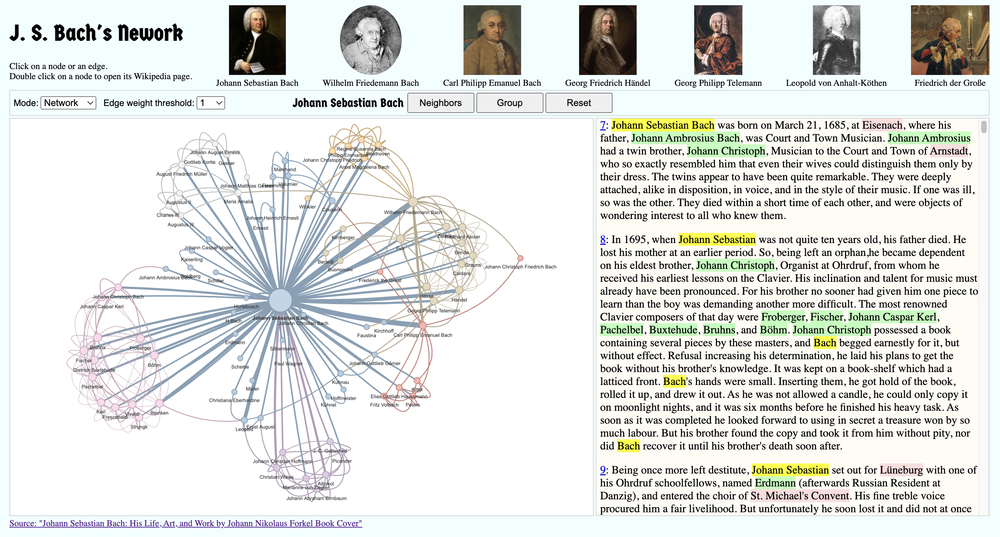

# J. S. Bach's Network with spaCy(NLP)

<a href="https://araobp.github.io/bach-network/bach_network.html
"></a>

This web app is hosted on: https://araobp.github.io/bach-network/bach_network.html

<h5>Note: This project is something I worked on independently as self-study during Y2023-2024 winter break.</h5>

## Background and Motivation

25 years ago, I lived in Berlin, Germany. Since Berlin is located in the northeastern part of Germany, I listened to a lot of Bach's music. I heard organ music and Christmas Oratorio in Protestant churches. Using Natural Language Processing (NLP) with spaCy, I created a social network diagram of Bach based on [a book on his works](https://www.gutenberg.org/cache/epub/35041/pg35041-images.html) obtained from Project Gutenberg. I referred to [Thu Vu's video](https://youtu.be/fAHkJ_Dhr50) on YouTube to learn the technique to generate such a network from a book. To create a more satisfying network, I made further improvements myself.

## Processing Pipeline

This is a pipeline I devised to generate the network from the web book and visualize it on a browser with no external databases.

```
<---- beauifulsoap ---->  <----- spaCy ------>  <--- networkx ---->  <-- graphology.js --->  <-- vis.js --->
[Web book]=>[Paragraphs]=>[NER/DepenencyGraph]=>[Network Formation]=>[Graph DB]=>[Subgraph]=>[Visualization]
<-- paragraphs.ipynb -->  <-------- bach_network.ipynb ----------->  <------ bach_network.html ------------>
```

### Jupyter Notebook

- [1. paragraphs.ipynb](ipynb/1.%20paragraphs.ipynb)
- [2. names.ipynb](ipynb/2.%20names.ipynb)
- [3. german_cities.ipynb](ipynb/3.%20german_cities.ipynb)
- [4. orgs.ipynb](ipynb/4.%20orgs.ipynb)
- [5. bach_network.ipynb](ipynb/5.%20bach_network.ipynb)

### Single Page App without SQLite3

All the resulting data is imported to the app in the form of JSON.
- [bach_network.html](docs/bach_network.html)

### Single Executable App with SQLite3

Client-Server archtecture in a single executable app.
- [app](app)

## Generating the Network

The network was generated by extracting Named Entity pairs for each paragraph.

### Grouping of Personal Names

The following is a famous passage also found in the book:

<h5>"The most renowned Clavier composers of that day were Froberger, Fischer, Johann Caspar Kerl, Pachelbel, Buxtehude, Bruhns, and Böhm. Johann Christoph possessed a book containing several pieces by these masters, and Bach begged earnestly for it, but without effect. Refusal increasing his determination, he laid his plans to get the book without his brother's knowledge. It was kept on a book-shelf which had a latticed front. Bach's hands were small. Inserting them, he got hold of the book, rolled it up, and drew it out. As he was not allowed a candle, he could only copy it on moonlight nights, and it was six months before he finished his heavy task. As soon as it was completed he looked forward to using in secret a treasure won by so much labour. But his brother found the copy and took it from him without pity, nor did Bach recover it until his brother's death soon after."</h5>

Regarding the above passage, it is necessary to create a network that is conscious of listing names, as follows:

```
Froberger ---------------+---------+--------- Johann Christoph Bach ------- Johann Sebastian Bach
                         |         |                                                 |
Fischer -----------------+         +-------------------------------------------------+
                         |
Johann Caspar Kerl ------+
                         |
Pachelbel ---------------+
                         |
Buxtehude ---------------+
                         |
Bruhns ------------------+
                         |
Böhm --------------------+
```


How can we accurately perform relation extraction? I devised the method below.

When names are listed, it might be beneficial to consider them as groups of nodes and connect them with edges to describe relationships between names (nodes) that are mentioned a little apart:
- Named Entity extraction within a paragraph.
- If Named Entities are enumerated, perceive them as a group, and adjust the edge weights between Named Entities within the group to be weaker.

## Dependencies

- [spaCy](https://spacy.io/)
- [networkx](https://networkx.org/documentation/stable/index.html)
- [graphology.js](https://graphology.github.io/)
- [vis.js (Network)](https://visjs.github.io/vis-network/docs/network/)
- [Leaflet](https://leafletjs.com/)
- [Beautiful Soup](https://www.crummy.com/software/BeautifulSoup/)

## Extra

- [Statue of Johann Sebastian Bach at Thomaskirsche in Leipzig, Germany](https://commons.wikimedia.org/wiki/File:Vxla-jsbach-at-thomaskirsche.jpg)
- [Thomaskirche Interior](https://en.wikipedia.org/wiki/File:Thomaskirche_Interior.jpg)
- [Schloss Köthen](https://commons.wikimedia.org/wiki/File:SchlossK%C3%B6then4-2012-2.JPG)
- [Adolph von Menzel: Frederick the Great Playing the Flute at Sanssouci](https://commons.wikimedia.org/wiki/File:Adolph_Menzel_-_Fl%C3%B6tenkonzert_Friedrichs_des_Gro%C3%9Fen_in_Sanssouci_-_Google_Art_Project.jpg)
- [Samira Spiegel plays: Jesu bleibet meine Freude (J.S. Bach)](https://youtu.be/kGt5i_YT07s)
